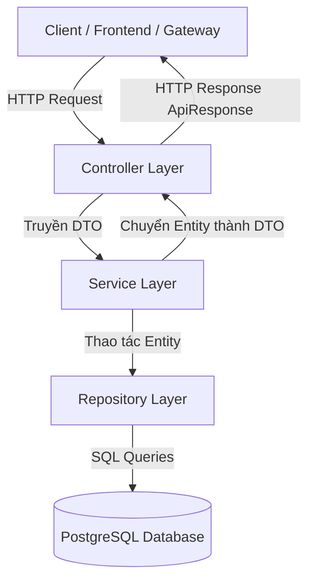
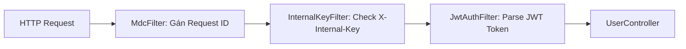

# 📘 Cẩm Nang Học Spring Boot Chi Tiết (Dành Cho Dự Án FinVault)

Tài liệu này tổng hợp toàn bộ **kiến thức, kiến trúc và mã nguồn** đã được xây dựng trong 2 dịch vụ `user-service` và `merchant-service`. Được viết theo phong cách dễ hiểu nhất để bạn vừa đọc code vừa nắm vững tư duy phát triển Backend bằng **Spring Boot 3.x**.

---

## 📚 MỤC LỤC

1. [Tổng quan Kiến trúc Phân tầng (Layered Architecture)](#1-tổng-quan-kiến-trúc-phân-tầng-layered-architecture)
2. [Chi tiết các Tầng trong Mã Nguồn](#2-chi-tiết-các-tầng-trong-mã-nguồn)
   - [Tầng 1: Entity / Model (Spring Data JPA)](#tầng-1-entity--model-spring-data-jpa)
   - [Tầng 2: Repository (Data Access)](#tầng-2-repository-data-access)
   - [Tầng 3: Service (Business Logic)](#tầng-3-service-business-logic)
   - [Tầng 4: DTO (Data Transfer Object) & Phản hồi chuẩn](#tầng-4-dto-data-transfer-object--phản-hồi-chuẩn)
   - [Tầng 5: Controller (REST API)](#tầng-5-controller-rest-api)
3. [Xử Lý Lỗi Tập Trung (Global Exception Handling)](#3-xử-lý-lỗi-tập-trung-global-exception-handling)
4. [Cấu Trúc Security & Filter Pipeline](#4-cấu-trúc-security--filter-pipeline)
   - [Filter 1: Correlation ID (MDC Logging)](#filter-1-correlation-id-mdc-logging)
   - [Filter 2: Bảo mật API Nội bộ (InternalKeyFilter)](#filter-2-bảo-mật-api-nội-bộ-internalkeyfilter)
5. [Quản Lý Database Migration Với Flyway](#5-quản-lý-database-migration-với-flyway)
6. [Kỹ Thuật Unit Test Với Mockito & H2 Database](#6-kỹ-thuật-unit-test-với-mockito--h2-database)
7. [Tối Ưu Đóng Gói Docker (Multi-stage Build)](#7-tối-ưu-đóng-gói-docker-multi-stage-build)

---

## 1. Tổng quan Kiến trúc Phân tầng (Layered Architecture)

Trong các ứng dụng Spring Boot thực tế, mã nguồn luôn được chia thành **5 tầng riêng biệt** theo nguyên lý *Single Responsibility Principle* (Mỗi lớp chỉ làm đúng 1 nhiệm vụ):



| Tầng | Thư mục trong dự án | Nhiệm vụ chính |
|---|---|---|
| **Controller** | `controller/` | Lắng nghe HTTP Request, kiểm tra tham số `@Valid`, gọi Service và trả về JSON `ApiResponse<T>`. |
| **Service** | `service/` | Xử lý logic kinh doanh (Business Logic), kiểm tra quyền truy cập, tính toán và ném Exception nếu sai. |
| **Repository** | `repository/` | Tương tác trực tiếp với Database qua Spring Data JPA (CRUD, SQL queries). |
| **Entity / Model** | `model/` | Lớp Java ánh xạ 1-1 với Bảng (Table) trong Database Postgres. |
| **DTO** | `dto/` | Đối tượng vận chuyển dữ liệu giữa Client và Server (không lộ trực tiếp Entity ra bên ngoài). |

---

## 2. Chi tiết các Tầng trong Mã Nguồn

### Tầng 1: Entity / Model (Spring Data JPA)
File mẫu: `user-service/.../model/User.java`

```java
@Entity
@Table(name = "users", indexes = {
    @Index(name = "idx_users_auth_user_id", columnList = "authUserId")
})
@Data
@Builder
@NoArgsConstructor
@AllArgsConstructor
public class User {

    @Id
    @Column(columnDefinition = "VARCHAR(36)")
    private String id; // Khóa chính UUID v4 dạng String

    @Column(nullable = false, unique = true, columnDefinition = "VARCHAR(36)")
    private String authUserId;

    @Enumerated(EnumType.STRING)
    @Column(nullable = false)
    private KycStatus kycStatus = KycStatus.NONE;

    private Instant deletedAt; // Dùng cho Soft Delete (xóa mềm)

    @Column(nullable = false, updatable = false)
    private Instant createdAt;

    @PrePersist
    protected void onCreate() {
        Instant now = Instant.now();
        this.createdAt = now;
        this.updatedAt = now;
        if (this.id == null || this.id.isBlank()) {
            this.id = UUID.randomUUID().toString(); // Tự gán UUID v4 ngẫu nhiên
        }
    }
}
```

#### 💡 Điểm học được:
- `@Entity` & `@Table`: Khai báo với Spring Boot rằng Class này đại diện cho 1 Table trong DB.
- `@Id`: Đánh dấu khóa chính. Quy chuẩn dự án dùng `String` (VARCHAR 36) chứ không dùng Auto-increment Long để tương thích với các Node.js microservices.
- `@PrePersist` & `@PreUpdate`: Hàm này tự động chạy ngay trước khi lưu dữ liệu mới hoặc cập nhật vào DB, giúp tự gán `createdAt`, `updatedAt` và `id` mà không cần viết tay trong Service.

---

### Tầng 2: Repository (Data Access)
File mẫu: `user-service/.../repository/UserRepository.java`

```java
@Repository
public interface UserRepository extends JpaRepository<User, String> {
    Optional<User> findByAuthUserId(String authUserId);
    boolean existsByAuthUserId(String authUserId);
    boolean existsByEmail(String email);
    Page<User> findByEmailContainingIgnoreCaseOrFullNameContainingIgnoreCase(String email, String fullName, Pageable pageable);
}
```

#### 💡 Điểm học được:
- **Spring Data JPA Magic**: Bạn chỉ cần khai báo `interface` kế thừa `JpaRepository<User, String>`. Spring Boot tự động sinh ra toàn bộ code SQL CRUD (`save`, `findById`, `deleteById`...) mà bạn **không cần viết 1 dòng SQL nào**.
- **Derived Query Methods**: Chỉ cần đặt tên phương thức theo quy ước như `findByAuthUserId` hay `existsByEmail`, Spring JPA sẽ tự phân tích tên hàm và tạo câu lệnh SQL `SELECT * FROM users WHERE auth_user_id = ?` tương ứng.

---

### Tầng 3: Service (Business Logic)
File mẫu: `user-service/.../service/UserServiceImpl.java`

```java
@Service
@RequiredArgsConstructor
public class UserServiceImpl implements UserService {

    private final UserRepository userRepository;

    @Override
    @Transactional
    public UserResponse createUser(CreateUserRequest request, Boolean isInternalCall) {
        // 1. Kiểm tra quyền gọi nội bộ
        if (!Boolean.TRUE.equals(isInternalCall)) {
            throw new UnauthorizedException("Unauthorized: Restricted to internal service calls");
        }

        // 2. Kiểm tra trùng lặp dữ liệu
        if (userRepository.existsByAuthUserId(request.getAuthUserId())) {
            throw new DuplicateResourceException("User with authUserId already exists");
        }

        // 3. Tạo Entity mới
        User user = User.builder()
                .id(UUID.randomUUID().toString())
                .authUserId(request.getAuthUserId())
                .email(request.getEmail())
                .kycStatus(KycStatus.NONE)
                .build();

        // 4. Lưu vào Database và chuyển thành DTO trả về
        User savedUser = userRepository.save(user);
        return UserResponse.fromEntity(savedUser);
    }
}
```

#### 💡 Điểm học được:
- **Interface & Impl Pattern**: Khai báo Interface `UserService` và Class triển khai `UserServiceImpl` giúp code dễ mở rộng, dễ viết Unit Test và giảm độ phụ thuộc trực tiếp (Decoupling).
- `@Transactional`: Đảm bảo tất cả các lệnh DB trong hàm chạy trong 1 Transaction. Nếu có lỗi giữa chừng, toàn bộ thao tác sẽ tự động được Rollback (hoàn tác), tránh rác DB.
- **Custom Exception**: Thay vì ném `Exception` chung chung, ta ném các lỗi rõ nghĩa như `UnauthorizedException`, `DuplicateResourceException`, `ResourceNotFoundException`.

---

### Tầng 4: DTO (Data Transfer Object) & Phản hồi chuẩn
File mẫu: `user-service/.../dto/ApiResponse.java`

```java
@Data
@Builder
@NoArgsConstructor
@AllArgsConstructor
public class ApiResponse<T> {
    private boolean success;
    private T data;
    private ApiError error;
    private String message;

    public static <T> ApiResponse<T> success(T data, String message) {
        return ApiResponse.<T>builder()
                .success(true)
                .data(data)
                .message(message)
                .build();
    }

    public static <T> ApiResponse<T> error(String code, String message) {
        return ApiResponse.<T>builder()
                .success(false)
                .error(new ApiError(code, message))
                .build();
    }
}
```

#### 💡 Điểm học được:
- **Generic Type `<T>`**: Cho phép `ApiResponse` bọc bất kỳ đối tượng dữ liệu nào (`UserResponse`, `MerchantResponse`, `PageResponse<T>`).
- **Khuôn chuẩn hệ thống**: Đảm bảo dù bất kỳ API nào thành công hay thất bại, định dạng JSON trả về cho Frontend luôn đồng nhất:
  ```json
  {
    "success": true,
    "data": { "id": "uuid-string", "email": "test@gmail.com" },
    "error": null,
    "message": "User profile created successfully"
  }
  ```

---

### Tầng 5: Controller (REST API)
File mẫu: `user-service/.../controller/UserController.java`

```java
@RestController
@RequestMapping("/api/users")
@RequiredArgsConstructor
@Tag(name = "User Management", description = "APIs quản lý hồ sơ người dùng")
public class UserController {

    private final UserService userService;

    @PostMapping
    public ResponseEntity<ApiResponse<UserResponse>> createUser(
            @Valid @RequestBody CreateUserRequest request,
            HttpServletRequest httpRequest) {
        Boolean isInternalCall = (Boolean) httpRequest.getAttribute("isInternalCall");
        UserResponse response = userService.createUser(request, isInternalCall);
        return ResponseEntity.status(HttpStatus.CREATED)
                .body(ApiResponse.success(response, "User profile created successfully"));
    }

    @GetMapping("/{id}")
    public ResponseEntity<ApiResponse<UserResponse>> getUserById(@PathVariable String id) {
        UserResponse response = userService.getUserById(id);
        return ResponseEntity.ok(ApiResponse.success(response));
    }
}
```

#### 💡 Điểm học được:
- `@RestController`: Kết hợp giữa `@Controller` và `@ResponseBody`, báo cho Spring biết kết quả trả về của các method sẽ tự động được chuyển đổi thành JSON.
- `@Valid` & `@RequestBody`: Lấy dữ liệu từ HTTP Request Body và tự động kiểm tra tính hợp lệ dựa trên các Annotation bên DTO (như `@NotBlank`, `@Email`).

---

## 3. Xử Lý Lỗi Tập Trung (Global Exception Handling)

Thay vì dùng `try-catch` ở từng Controller làm rối mã nguồn, Spring Boot hỗ trợ cơ chế bắt lỗi tập trung bằng `@RestControllerAdvice`:

File mẫu: `GlobalExceptionHandler.java`

```java
@Slf4j
@RestControllerAdvice
public class GlobalExceptionHandler {

    // Bắt lỗi Validation (ví dụ: thiếu email, nhập số âm...)
    @ExceptionHandler(MethodArgumentNotValidException.class)
    public ResponseEntity<ApiResponse<Void>> handleValidationException(MethodArgumentNotValidException ex) {
        return ResponseEntity.status(HttpStatus.BAD_REQUEST)
                .body(ApiResponse.error("VALIDATION_ERROR", "Dữ liệu đầu vào không hợp lệ"));
    }

    // Bắt lỗi Không tìm thấy tài nguyên (HTTP 404)
    @ExceptionHandler(ResourceNotFoundException.class)
    public ResponseEntity<ApiResponse<Void>> handleNotFound(ResourceNotFoundException ex) {
        return ResponseEntity.status(HttpStatus.NOT_FOUND)
                .body(ApiResponse.error("NOT_FOUND", ex.getMessage()));
    }

    // Bắt lỗi Trùng lặp dữ liệu (HTTP 409)
    @ExceptionHandler(DuplicateResourceException.class)
    public ResponseEntity<ApiResponse<Void>> handleDuplicate(DuplicateResourceException ex) {
        return ResponseEntity.status(HttpStatus.CONFLICT)
                .body(ApiResponse.error("DUPLICATE_RESOURCE", ex.getMessage()));
    }
}
```

#### 🎯 Tác dụng:
Khi tầng Service ném ra `throw new ResourceNotFoundException("User not found")`, `@RestControllerAdvice` sẽ tự động chặn lỗi đó lại, biến nó thành response JSON sạch sẽ với mã HTTP **404 NOT_FOUND**.

---

## 4. Cấu Trúc Security & Filter Pipeline

Trước khi một HTTP Request tới được Controller, nó phải đi qua một chuỗi các **Filter** (Filter Chain):



### Filter 1: Correlation ID (MDC Logging)
File: `MdcFilter.java`
- Đọc header `X-Request-Id` từ API Gateway gửi xuống.
- Nạp mã này vào `MDC.put("requestId", requestId)`.
- Nhờ vậy, mọi dòng log sinh ra trong quá trình xử lý Request đó đều tự động đính kèm mã Request ID, giúp lập trình viên dễ dàng tra cứu log (Traceability).

### Filter 2: Bảo mật API Nội bộ (InternalKeyFilter)
File: `InternalKeyFilter.java`
- Kiểm tra các đường dẫn API nội bộ (ví dụ: `POST /api/users` hoặc `PATCH /api/users/*/kyc-status`).
- Nếu request thiếu hoặc sai header `X-Internal-Key`, Filter sẽ **chặn lại ngay lập tức** và trả về HTTP **401 UNAUTHORIZED** mà không cho đi tiếp vào Controller.

---

## 5. Quản Lý Database Migration Với Flyway

Trong dự án thực tế, **không được dùng** `hibernate.ddl-auto: update` vì nó tự sửa bảng nguy hiểm trên Production. Thay vào đó ta dùng **Flyway**.

### Cách hoạt động:
1. File SQL đặt tại `src/main/resources/db/migration/V1__init.sql`:
   ```sql
   CREATE TABLE IF NOT EXISTS users (
       id VARCHAR(36) PRIMARY KEY,
       auth_user_id VARCHAR(36) NOT NULL UNIQUE,
       email VARCHAR(255) NOT NULL UNIQUE,
       kyc_status VARCHAR(20) NOT NULL DEFAULT 'NONE',
       created_at TIMESTAMP WITH TIME ZONE NOT NULL,
       updated_at TIMESTAMP WITH TIME ZONE NOT NULL,
       deleted_at TIMESTAMP WITH TIME ZONE
   );
   ```
2. Mỗi khi ứng dụng Spring Boot khởi động, Flyway tự động kiểm tra cơ sở dữ liệu. Nếu bảng chưa có hoặc có file script `V2__...` mới, Flyway sẽ tự chạy SQL.

---

## 6. Kỹ Thuật Unit Test Với Mockito & H2 Database

Để kiểm thử nhanh logic của Service mà **không cần bật Database PostgreSQL thật**, ta dùng **Mockito** để giả lập (Mock) tầng Repository và **H2 Database** (Database chạy trên RAM).

File mẫu: `UserServiceTest.java`

```java
@ExtendWith(MockitoExtension.class)
class UserServiceTest {

    @Mock
    private UserRepository userRepository; // Giả lập Repository

    @InjectMocks
    private UserServiceImpl userService; // Tiêm Mock vào Service

    @Test
    void createUser_Success() {
        // GIVEN: Chuẩn bị dữ liệu mẫu
        CreateUserRequest request = new CreateUserRequest();
        request.setAuthUserId("auth-123");
        request.setEmail("test@example.com");

        when(userRepository.existsByAuthUserId("auth-123")).thenReturn(false);
        when(userRepository.save(any(User.class))).thenAnswer(i -> i.getArgument(0));

        // WHEN: Thực thi hàm cần test
        UserResponse response = userService.createUser(request, true);

        // THEN: Kiểm tra kết quả có đúng kỳ vọng không
        assertNotNull(response);
        assertEquals("auth-123", response.getAuthUserId());
        verify(userRepository, times(1)).save(any(User.class));
    }
}
```

---

## 7. Tối Ưu Đóng Gói Docker (Multi-stage Build)

File mẫu: `Dockerfile`

```dockerfile
# Stage 1: Build file JAR từ mã nguồn Java bằng Maven
FROM maven:3.9-eclipse-temurin-21 AS build
WORKDIR /app
COPY pom.xml .
COPY src ./src
RUN mvn clean package -DskipTests

# Stage 2: Tạo container nhẹ chỉ chứa JRE để chạy ứng dụng
FROM eclipse-temurin:21-jre
WORKDIR /app
COPY --from=build /app/target/*.jar app.jar
EXPOSE 3002
ENTRYPOINT ["java", "-jar", "app.jar"]
```

#### 💡 Lợi ích của Multi-stage Build:
- Stage 1 dùng image chứa đầy đủ bộ biên dịch Maven và JDK (nặng ~700MB).
- Stage 2 chỉ copy đúng 1 file `app.jar` đã đóng gói sang image JRE tinh gọn (chỉ ~200MB), giúp container khởi động cực nhanh và tiết kiệm dung lượng Server.

---

## 🏁 LỜI KHUYÊN DÀNH CHO BẠN KHI HỌC SPRING BOOT

1. **Hãy đọc code theo luồng**: Từ `Controller` ➔ `Service` ➔ `Repository` ➔ `Entity`.
2. **Hãy chú ý tới các Annotation**: `@RestController`, `@Service`, `@Repository`, `@Transactional`, `@Valid`, `@ExceptionHandler`. Nắm được ý nghĩa của các annotation này là bạn đã nắm được 70% sức mạnh của Spring Boot!
3. **Thực hành bằng cách tạo endpoint mới**: Thử tạo thêm một field mới trong DTO/Entity hoặc thêm 1 API tìm kiếm đơn giản để quen tay.
